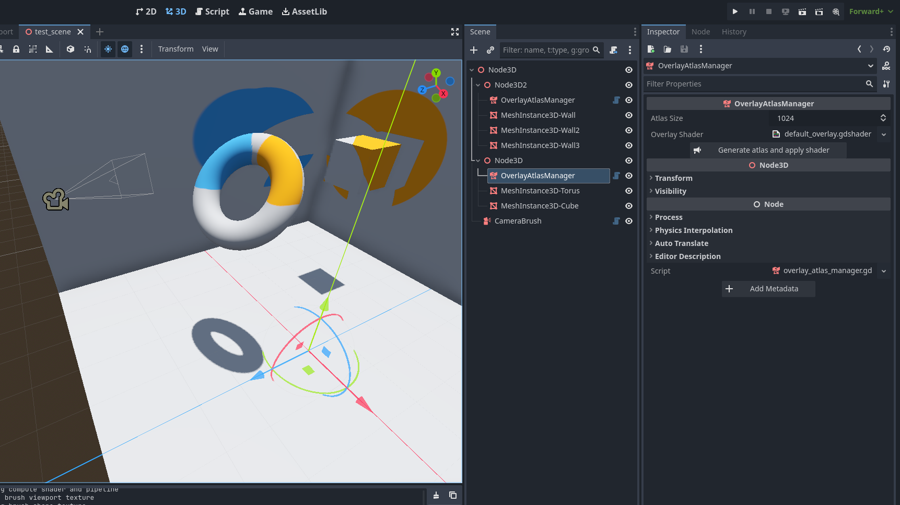
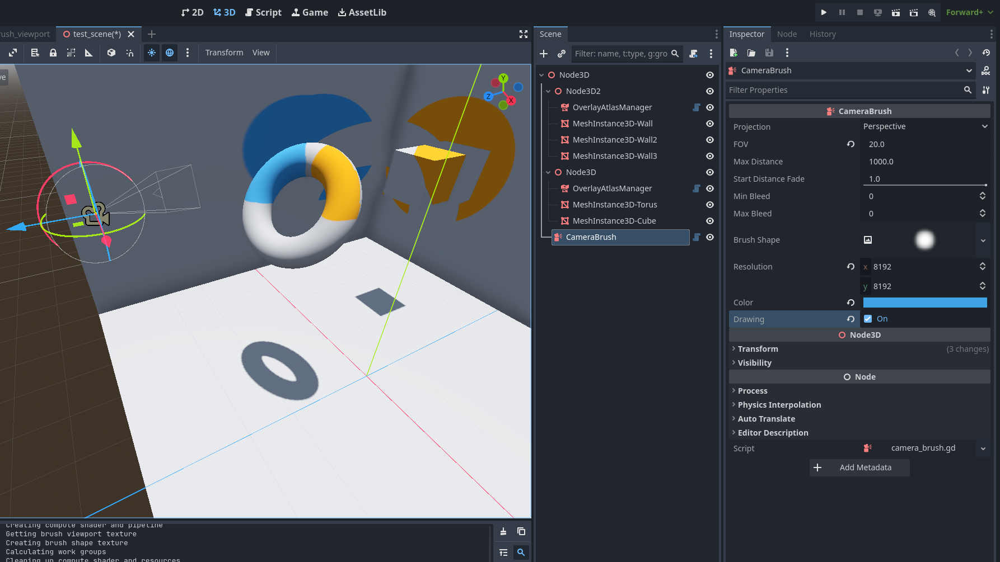
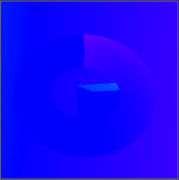

# Godot GPU Texture Painter

GPU Texture Painter is a plugin for the Godot-Engine, that can be utilized to create game mechanics like spray painting, drawing or splatoon ink.

It supports high precision / realistic painting, multiple meshes, and the ability to choose the brush shape and color freely. Since it runs fully on the GPU it is blazing fast.

Godot 4.4+ supported.

Feel free to use this addon in any project or use it as inspiration to create your own texture painter running on the GPU :)

For bug reports, feature requests and questions please open an issue.

## Features

- Brush / spray viewpoint rendered by camera -> resembles **individual particles**
- Achieves realistic and fine painting across multiple meshes
- No PhysicsServer or CollisionShapes needed. (Relies fully on 3D rendering techniques)
- Works at runtime & in editor
- Up to 8 overlay texture atlases per scene
- Arbitrary amount of meshes per atlas
- Arbitrary brush shapes provided by an image
- Resolution and other performance settings

## Usage

Install via the [Godot Asset Library](https://godotengine.org/asset-library/asset/4486).
The addon adds two nodes: The **OverlayAtlasManager** for the management of materials and textures and the **CameraBrush** for painting onto the textures.

### Overlay Atlas Creation

- Add **OverlayAtlasManager** Node as sibling or parent to MeshInstance3D nodes.
    - Use hierarchy for compartmentalization of atlases.
    - All meshes need to have the UV2 unwrapped as described [here](https://docs.godotengine.org/en/stable/tutorials/3d/global_illumination/using_lightmap_gi.html#setting-up).
- Set the wanted texture size.
- Set the shader file used for the overlay material. See [Appearance of the Overlay](#overlay-atlas-creation).
- Press **"Generate atlas and apply shader"** to generate the atlas packing and apply the overlay shader material to all materials.
- Alternatively, call the **apply()** method in a script.

### Camera Brush

- Add a **CameraBrush** Node to the scene. Make it a child of the camera for example, to make it moved by the player.
- The **Projection** mode controls the type of the brush:
    - Perspective: Paint spreads, e.g. spray cans
    - Orthogonal: Brush size stays constant, e.g. pencils
- **FOV/Size**: The size of the brush
- **Max Distance**: The range of the brush. (Affects performance)
- **Start Distance Fade**: At which distance the brush should start to fade to full transparency.
- **Bleed**: How many texels should be drawn in the atlas around the texels rendered by the CameraBrush. Increase to reduce artifacts. (Affects performance)
- **Brush Shape**: Image of the brush shape. The R Channel dictates, how much paint is applied.
- **Resolution**: Resolution of the CameraBrush render target. Increase or decrease until holes in the painting disappear. (Affects performance)
- **Color**: Color of the brush. Opacity can be set.
- **Draw Speed**: The rate at which the paint is applied.
- **Drawing**: If enabled the brush renders and paint is applied. Can also be set from script. 

### Appearance of the overlay

- Duplicate the overlay_template.gdshader file.
- Insert your custom shader code at the placeholder.

## How it works

- All meshes are packed into an overlay texture atlas utilizing the unwrapped UV2 coordinates.
- **Each CameraBrush renders to an offline framebuffer/subviewport.**
    - Each mesh renders the fragment's **UV2 atlas coordinates as its color** into the texture. UVs are remapped to (-0.5,0.5) for greater IEEE 754 FP16 precision (16 bit is a Godot limitation) (First Image)
    - Blue channel of the render target is used to store the depth and atlas index. (Second Image, how it is in the addon)
        - Godot converts float to half precision during the render -> only 14 bits are unchanged during conversion
        - Depth is stored in bit 14-24 -> truncated to 11 bits
        - Index is stored in bit 32 & 25-26 -> 3 bits -> up to 8 atlases simultaneously.
- This render texture is fed to a **compute shader**.
    - It iterates over every texel (imageLoad), **retrieves the UV coordinates** and atlas index, and **writes into the indexed overlay atlas texture at the given coordinate** (imageStore).
    - Compute colors according to shape image, color, and distance.
    - If bleed is used, neighboring texels are filled as well
